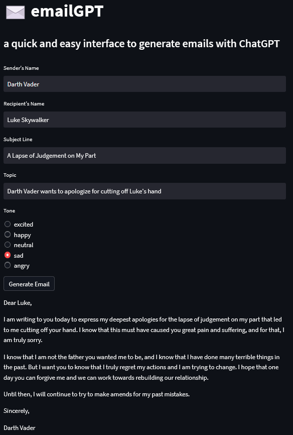
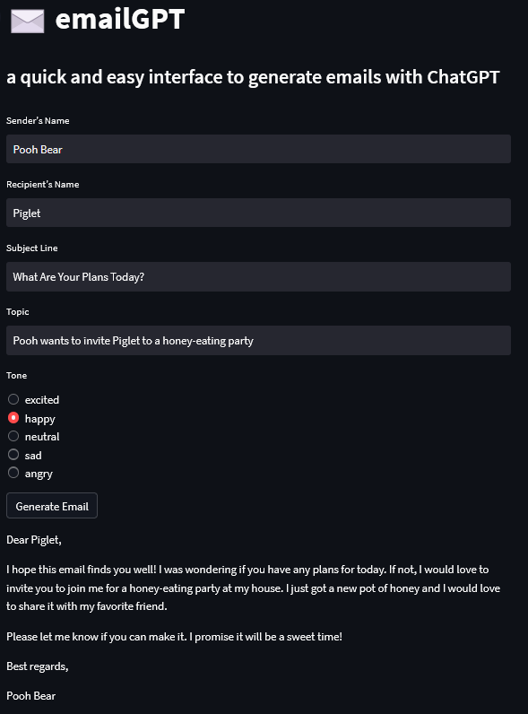
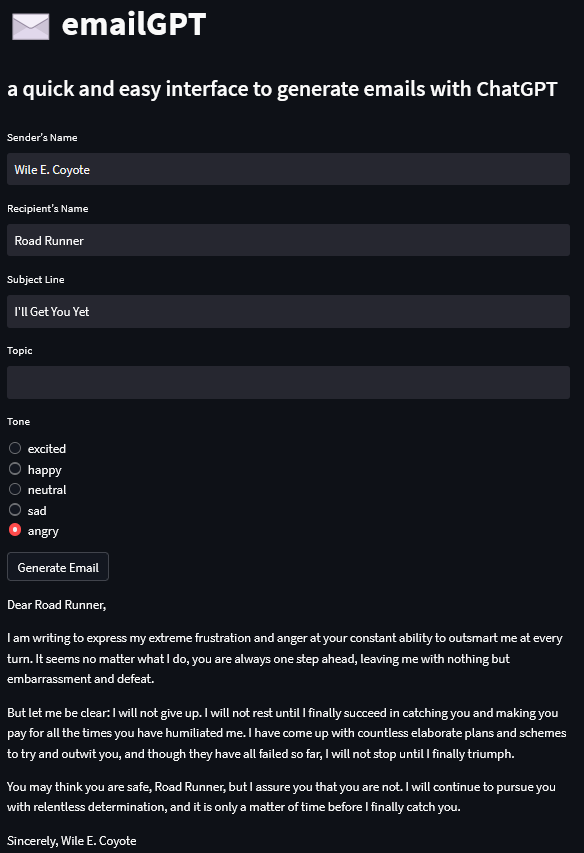

[](https://lbesson.mit-license.org/)
[](https://github.com/psf/black)

# emailGPT

`emailGPT` is a quick and easy interface to generate emails with [ChatGPT](https://openai.com/blog/chatgpt/).


## Table of Contents
* [Table of Contents](#table-of-contents)
* [Examples](#examples)
* [Usage](#usage)
* [Installation](#installation)
* [Contact](#contact)
* [License](#license)


## Examples


<br><br>


<br><br>




## Usage

`emailGPT` is deployed as a `Streamlit` app. It is available [here](https://lucasmccabe-emailgpt-app-jspyxu.streamlit.app/).

## Installation

If you're using the [`Streamlit`](https://lucasmccabe-emailgpt-app-jspyxu.streamlit.app/) app, no installation is necessary. Otherwise:

##### Installation via GitHub
Clone the repo from [here](https://github.com/lucasmccabe/emailGPT) (this repo).

Install requirements:
```bash
pip install -r requirements.txt
```

## Contact

Questions? Reach out:
- Lucas ([email](mailto:lucasmccabe@gwu.edu))

## License
[MIT](https://choosealicense.com/licenses/mit/)
